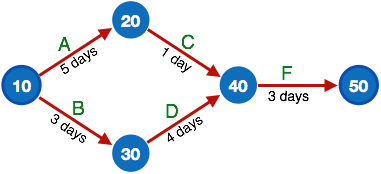

- [What is software engineering?](#what-is-software-engineering)
- [Why we need software engineering](#why-we-need-software-engineering)
- [Key Processes in Software Engineering](#key-processes-in-software-engineering)
- [Software Evolution](#software-evolution)
- [Types of Software Maintenance](#types-of-software-maintenance)
- [Software Evolution Law](#software-evolution-law)
  - [Classification of softwares](#classification-of-softwares)
    - [E-Type software evolution](#e-type-software-evolution)
- [Characteristics of good software](#characteristics-of-good-software)
- [SDLC](#sdlc)
- [Process Models](#process-models)
  - [Waterfall Model](#waterfall-model)
  - [Iterative/Incremental Model](#iterativeincremental-model)
  - [Spiral Model](#spiral-model)
  - [RAD](#rad)
  - [V-Model](#v-model)
  - [Big Bang Model](#big-bang-model)
- [Some differences between models](#some-differences-between-models)
  - [Iterative vs Spiral](#iterative-vs-spiral)
  - [RAD vs Iterative](#rad-vs-iterative)
- [Project Management](#project-management)
  - [Risks](#risks)
  - [Risk Management Process](#risk-management-process)
  - [Project Monitoring](#project-monitoring)
  - [Communication](#communication)
  - [Project Management Tools](#project-management-tools)
    - [Gantt Chart](#gantt-chart)
    - [PERT Chart](#pert-chart)
    - [Resource Histogram](#resource-histogram)
  - [Critical Path Analysis](#critical-path-analysis)
- [Agile](#agile)
  - [Agile Values](#agile-values)
  - [Agile Principles](#agile-principles)
  - [Agile Software Development](#agile-software-development)
- [Scrum](#scrum)
- [Crash-Review](#crash-review)
- [Must Read Book(s)](#must-read-books)

## What is software engineering?

- Software engineering is combination of two words `Software` and `Engineering`
- the later word is derived from engineer which simply means:
- someone who `desgin`, `build` and `maintain` structures 
- and `software`s simply are non-physical structures that help in communication with computers. 

> and `software engineering` is the systematic engineering approach for designing, building, and maintaining `softwares`

## Why we need software engineering

Software engineering is important because specific software is needed in almost every industry, in every business, and for every function. It becomes more important as time goes on – if something breaks within your application portfolio, a quick, efficient, and effective fix needs to happen as soon as possible.

## Key Processes in Software Engineering

- Requirements Definition
- Feasibility Study
- System and Software Design
- Implementation and Unit Testing
- Integration and System Testing
- Operation and Maintenance

## Software Evolution

Software Evolution is a term which refers to the process of developing software initially, then timely updating it for various reasons, i.e., to add new features or to remove obsolete functionalities etc.

Some of these factors include:

- Requirement changes
- Environment changes
- Errors or security breaches
- New equipment added or removed, and finally
- Improvements to the system

## Types of Software Maintenance

- Corrective
- Adaptive
- Perfective
- preventive
  - concerned with making changes that ensures the longevity of the software. This may include code optimizing, code restructuring, and documentation.

## Software Evolution Law

> According to Lehman's laws of software evolution, on the one side, the size and the complexity of a software system will continually increase in its life time; on the other side, the quality of a software system will decrease unless it is rigorously maintained and adapted.

### Classification of softwares

> static where specifications and solutions both are known, practical type are the ones where solutions and methods are to be worked upon, whereas in e types specifications as well as solutions and methods keep changing

Lehman has given laws for software evolution. He divided the software into three different categories:

- S-type (static-type) - This is a software, which works strictly according to defined specifications and solutions. The solution and the method to achieve it, both are immediately understood before coding. The s-type software is least subjected to changes hence this is the simplest of all. For example, calculator program for mathematical computation.
- P-type (practical-type) - This is a software with a collection of procedures. This is defined by exactly what procedures can do. In this software, the specifications can be described but the solution is not obvious instantly. For example, gaming software.
- E-type (embedded-type) - This software works closely as the requirement of real-world environment. This software has a high degree of evolution as there are various changes in laws, taxes etc. in the real world situations. For example, Online trading software.

#### E-Type software evolution
Lehman has given eight laws for E-Type software evolution -

- Continuing change - An E-type software system must continue to adapt to the real world changes, else it becomes progressively less useful.
- Increasing complexity - As an E-type software system evolves, its complexity tends to increase unless work is done to maintain or reduce it.
- Conservation of familiarity - The familiarity with the software or the knowledge about how it was developed, why was it developed in that particular manner etc. must be retained at any cost, to implement the changes in the system.
- Continuing growth- In order for an E-type system intended to resolve some business problem, its size of implementing the changes grows according to the lifestyle changes of the business.
- Reducing quality - An E-type software system declines in quality unless rigorously maintained and adapted to a changing operational environment.
- Feedback systems- The E-type software systems constitute multi-loop, multi-level feedback systems and must be treated as such to be successfully modified or improved.
- Self-regulation - E-type system evolution processes are self-regulating with the distribution of product and process measures close to normal.
- Organizational stability - The average effective global activity rate in an evolving E-type system is invariant over the lifetime of the product.

## Characteristics of good software

tested on the basis of following grounds:

- Operational
  - This tells us how well software works in operations.
    - Budget
    - Usability
    - Efficiency
    - Correctness
    - Functionality
    - Dependability
    - Security
    - Safety
- Transitional
  - This tells us how well software works when the software is moved from one platform to another
    - Portability
    - Interoperability
    - Reusability
    - Adaptability
- Maintenance
  - This aspect briefs about how well a software has the capabilities to maintain itself in the ever-changing environment
    - Modularity
    - Maintainability
    - Flexibility
    - Scalability

## SDLC
Software Development Life Cycle, SDLC for short, is a well-defined, structured sequence of stages in software engineering to develop the intended software product.
 
Steps: [Key Processes in Software Engineering](#key-processes-in-software-engineering)

## Process Models

### Waterfall Model

> all the phases of SDLC will function one after another in linear manner

### Iterative/Incremental Model

This model leads the software development process in iterations. It projects the process of development in cyclic manner repeating every step after every cycle of SDLC process.

The software is first developed on very small scale and all the steps are followed which are taken into consideration. Then, on every next iteration, more features and modules are designed, coded, tested and added to the software. Every cycle produces a software, which is complete in itself and has more features and capabilities than that of the previous one.

> a cycle includes small portion of whole software process

### Spiral Model

Spiral model is a combination of both, iterative model and one of the SDLC model

### RAD

### V-Model

The major drawback of waterfall model is we move to the next stage only when the previous one is finished and there was no chance to go back if something is found wrong in later stages. V-Model provides means of testing of software at each stage in reverse manner.

### Big Bang Model

This model is the simplest model in its form. It requires little planning, lots of programming and lots of funds. This model is conceptualized around the big bang of universe. As scientists say that after big bang lots of galaxies, planets and stars evolved just as an event. Likewise, if we put together lots of programming and funds, you may achieve the best software product.

For this model, very small amount of planning is required. It does not follow any process, or at times the customer is not sure about the requirements and future needs. So the input requirements are arbitrary.

## Some differences between models

### Iterative vs Spiral

### RAD vs Iterative

**Iterative waterfall model**  
All product functionalities are developed together.
It does not facilitate accommodating requirement change requests.
The uses of the iterative waterfall model lead to the production of good documentation.
Also, the developed software usually has better quality and reliability than that developed using RAD.

**Rapid Application Development model:**  
Product functionalities are developed incrementally through heavy code and design reuse.
Customer feedback is obtained on the developed prototype after each iteration, based on this prototype is redefined.

## Project Management

### Risks

- Experienced staff leaving the project and new staff coming in.
- Change in organizational management.
- Requirement change or misinterpreting requirement.
- Under-estimation of required time and resources.
- Technological changes, environmental changes, business competition.

### Risk Management Process

There are following activities involved in risk management process:

- Identify - Make note of all possible risks, which may occur in the project.
- Categorize - Categorize known risks into high, medium and low risk intensity as per their possible impact on the project.
- Manage - Analyze the probability of occurrence of risks at various phases. Make plan to avoid or face risks. Attempt to minimize their side-effects.
- Monitor - Closely monitor the potential risks and their early symptoms. Also monitor the effects of steps taken to mitigate or avoid them.

### Project Monitoring

- Activity Monitoring - All activities scheduled within some task can be monitored on day-to-day basis. When all activities in a task are completed, it is considered as complete.
- Status Reports - The reports contain status of activities and tasks completed within a given time frame, generally a week. Status can be marked as finished, pending or work-in-progress etc.
- Milestones Checklist - Every project is divided into multiple phases where major tasks are performed (milestones) based on the phases of SDLC. This milestone checklist is prepared once every few weeks and reports the status of milestones.

### Communication

Communication can be oral or written. Communication management process may have the following steps:

- Planning - This step includes the identifications of all the stakeholders in the project and the mode of communication among them. It also considers if any additional communication facilities are required.
- Sharing - After determining various aspects of planning, manager focuses on sharing correct information with the correct person on correct time. This keeps every one involved the project up to date with project progress and its status.
- Feedback - Project managers use various measures and feedback mechanism and create status and performance reports. This mechanism ensures that input from various stakeholders is coming to the project manager as their feedback.
- Closure - At the end of each major event, end of a phase of SDLC or end of the project itself, administrative closure is formally announced to update every stakeholder by sending email, by distributing a hardcopy of document or by other mean of effective communication.
  

###  Project Management Tools

#### Gantt Chart

It is a horizontal bar chart with bars representing activities and time scheduled for the project activities.

#### PERT Chart

PERT (Program Evaluation & Review Technique) chart is a tool that depicts project as network diagram. It is capable of graphically representing main events of project in both parallel and consecutive way. Events, which occur one after another, show dependency of the later event over the previous one.

#### Resource Histogram

This is a graphical tool that contains bar or chart representing number of resources (usually skilled staff) required over time for a project event (or phase). Resource Histogram is an effective tool for staff planning and coordination.

### Critical Path Analysis

This tools is useful in recognizing interdependent tasks in the project. It also helps to find out the shortest path or critical path to complete the project successfully. Like PERT diagram, each event is allotted a specific time frame. This tool shows dependency of event assuming an event can proceed to next only if the previous one is completed.

The events are arranged according to their earliest possible start time. Path between start and end node is critical path which cannot be further reduced and all events require to be executed in same order.

## Agile

Agile is the ability to create and respond to change. It is a way of dealing with, and ultimately succeeding in, an uncertain and turbulent environment.

The authors of the Agile Manifesto chose “Agile” as the label for this whole idea because that word `represented the adaptiveness and response to change which was so important to their approach`.

It’s really about thinking through how you can understand what’s going on in the environment that you’re in today, identify what uncertainty you’re facing, and figure out how you can adapt to that as you go along.

### Agile Values

1. Individuals and Interactions Over Processes and Tools
   1. Valuing people more highly than processes or tools is easy to understand because it is the people who respond to business needs and drive the development process. If the process or the tools drive development, the team is less responsive to change and less likely to meet customer needs. Communication is an example of the difference between valuing individuals versus process. In the case of individuals, communication is fluid and happens when a need arises. In the case of process, communication is scheduled and requires specific content.
2. Working Software Over Comprehensive Documentation
   1. Historically, enormous amounts of time were spent on documenting the product for development and ultimate delivery. Technical specifications, technical requirements, technical prospectus, interface design documents, test plans, documentation plans, and approvals required for each. The list was extensive and was a cause for the long delays in development. Agile does not eliminate documentation, but it streamlines it in a form that gives the developer what is needed to do the work without getting bogged down in minutiae. Agile documents requirements as user stories, which are sufficient for a software developer to begin the task of building a new function.
   The Agile Manifesto values documentation, but it values working software more.
3. Customer Collaboration Over Contract Negotiation
   1. Negotiation is the period when the customer and the product manager work out the details of a delivery, with points along the way where the details may be renegotiated. Collaboration is a different creature entirely. With development models such as Waterfall, customers negotiate the requirements for the product, often in great detail, prior to any work starting. This meant the customer was involved in the process of development before development began and after it was completed, but not during the process. The Agile Manifesto describes a customer who is engaged and collaborates throughout the development process, making. This makes it far easier for development to meet their needs of the customer. Agile methods may include the customer at intervals for periodic demos, but a project could just as easily have an end-user as a daily part of the team and attending all meetings, ensuring the product meets the business needs of the customer.
4. Responding to Change Over Following a Plan
   1. Traditional software development regarded change as an expense, so it was to be avoided. The intention was to develop detailed, elaborate plans, with a defined set of features and with everything, generally, having as high a priority as everything else, and with a large number of many dependencies on delivering in a certain order so that the team can work on the next piece of the puzzle.

### Agile Principles

The twelve principles of agile development include:

1. **Customer satisfaction through early and continuous software delivery** – Customers are happier when they receive working software at regular intervals, rather than waiting extended periods of time between releases.
1. **Accommodate changing requirements throughout the development process** – The ability to avoid delays when a requirement or feature request changes.
1. **Frequent delivery of working software** – Scrum accommodates this principle since the team operates in software sprints or iterations that ensure regular delivery of working software.
2. **Collaboration between the business stakeholders and developers throughout the project** – Better decisions are made when the business and technical team are aligned.
3. **Support, trust, and motivate the people involved** – Motivated teams are more likely to deliver their best work than unhappy teams.
4. **Enable face-to-face interactions** – Communication is more successful when development teams are co-located.
5. **Working software is the primary measure of progress** – Delivering functional software to the customer is the ultimate factor that measures progress.
6. **Agile processes to support a consistent development pace** – Teams establish a repeatable and maintainable speed at which they can deliver working software, and they repeat it with each release.
7. **Attention to technical detail and design enhances agility** – The right skills and good design ensures the team can maintain the pace, constantly improve the product, and sustain change.
8. **Simplicity** – Develop just enough to get the job done for right now.
9. **Self-organizing teams encourage great architectures, requirements, and designs** – Skilled and motivated team members who have decision-making power, take ownership, communicate regularly with other team members, and share ideas that deliver quality products.
1. **Regular reflections on how to become more effective** – Self-improvement, process improvement, advancing skills, and techniques help team members work more efficiently.
  
The intention of Agile is to align development with business needs, and the success of Agile is apparent. Agile projects are customer focused and encourage customer guidance and participation. As a result, Agile has grown to be an overarching view of software development throughout the software industry and an industry all by itself.

### Agile Software Development

Agile software development is more than frameworks such as Scrum, Extreme Programming, or Feature-Driven Development (FDD).

Agile software development is more than practices such as pair programming, test-driven development, stand-ups, planning sessions, and sprints.

## Scrum

> Framework for Agile

Scrum is simple.  It is the opposite of a big collection of interwoven mandatory components. Scrum is not a methodology. Scrum implements the scientific method of empiricism. Scrum replaces a programmed algorithmic approach with a heuristic one, with respect for people and self-organization to deal with unpredictability and solving complex problems.  The below graphic represents Scrum in Action as described by Ken Schwaber and Jeff Sutherland in their book Software in 30 Days taking us from planning through software delivery.  

## Crash-Review
- What is Software Engineering?
- Phase 1 - Requirements Gathering & Analysis
  - Requirements Gathering Techniques
    - Use Case Analysis
    - User Stories
  - Requirements Analysis
  - Prototyping
- Phase 2 - Program Design & Planning
  - Modularization of Program
  - Coupling and Cohesion
  - Example: Coupling and Cohesion
  - Separation of Concerns: Benefits of a good design
- Phase 3 - Program Development
  - Programming Patterns
    - Example: Model-View-Controller (MVC) Pattern
    - Application of MVC
  - Code Readability
    - Example: Constants vs Magic Numbers
    - Example: Standardized Naming Conventions
  - Revision Control Systems (Git, Github)
- Phase 4 - Program Testing
  - Automated Testing
    - Unit Testing
    - Integration Testing
    - Example: Integration Testing
  - Black vs Glass Box Testing
  - GUI Testing
  - Security Testing
  - Code Coverage
  - Test-Driven Development (TDD)

## Must Read Book(s)

- [PMBOK](static/books/PMBOK-7th-Edition.pdf)

<!-- ## Continue here -->
<!-- https://www.tutorialspoint.com/software_engineering/software_requirements.htm -->